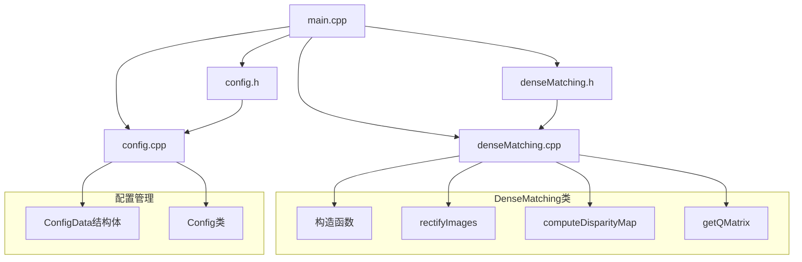
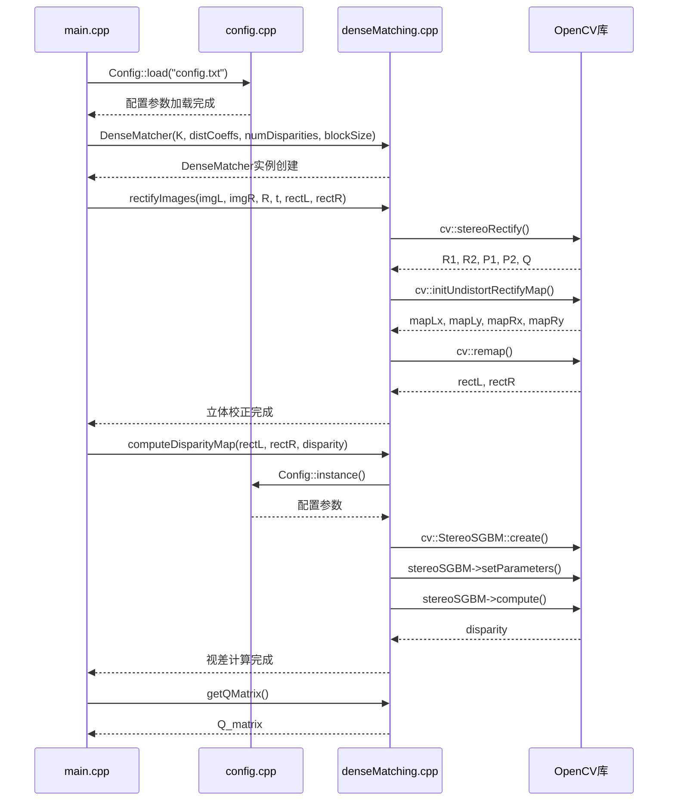
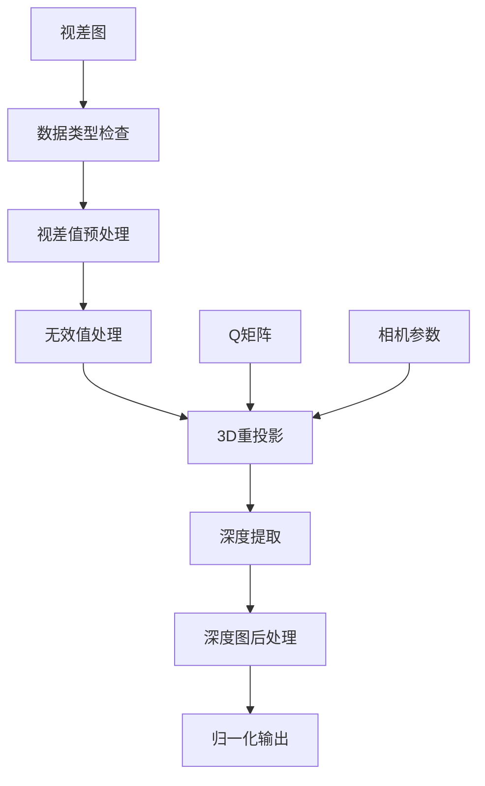

# 立体视觉系统DenseMatching模块分析报告

## 1. 系统概述

本报告专注于分析立体视觉系统中的DenseMatching模块，详细总结所有相关的程序文件、调用方法和目前系统中可供使用的matching方法。DenseMatching是立体视觉系统的核心组件，负责立体校正和高质量的视差计算。

## 2. DenseMatching模块架构



## 3. 相关程序文件分析

### 3.1 核心实现文件

#### 3.1.1 `denseMatching.h` - 头文件定义
```cpp
class DenseMatcher {
public:
    DenseMatcher(const cv::Mat& K, const cv::Mat& distCoeffs,
                 int numDisparities, int blockSize);

    bool rectifyImages(const cv::Mat& imgL, const cv::Mat& imgR,
                       const cv::Mat& R, const cv::Mat& t,
                       cv::Mat& rectL, cv::Mat& rectR);

    bool computeDisparityMap(const cv::Mat& rectL, const cv::Mat& rectR,
                             cv::Mat& disparity);

    const cv::Mat& getQMatrix() const;

private:
    cv::Mat K_;                    // 相机内参矩阵
    cv::Mat distCoeffs_;           // 畸变系数
    int numDisparities_;           // 视差搜索范围
    int blockSize_;                // 匹配窗口大小
    cv::Mat Q_;                    // 重投影矩阵
};
```

**功能说明：**
- 定义DenseMatcher类的接口
- 包含4个公共方法和5个私有成员变量
- 提供立体校正、视差计算和Q矩阵获取功能

#### 3.1.2 `denseMatching.cpp` - 核心实现
```cpp
#include "denseMatching.h"
#include "config.h"
#include <iostream>
```

**主要方法实现：**

1. **构造函数**
```cpp
DenseMatcher::DenseMatcher(const cv::Mat& K, const cv::Mat& distCoeffs,
                           int numDisparities, int blockSize)
    : K_(K.clone()), distCoeffs_(distCoeffs.clone()),
      numDisparities_(numDisparities), blockSize_(blockSize) {
}
```

2. **立体校正方法**
```cpp
bool DenseMatcher::rectifyImages(const cv::Mat& imgL, const cv::Mat& imgR,
                                 const cv::Mat& R, const cv::Mat& t,
                                 cv::Mat& rectL, cv::Mat& rectR) {
    // 立体校正
    cv::Mat R1, R2, P1, P2, Q;
    cv::stereoRectify(K_, distCoeffs_, K_, distCoeffs_,
                      imgL.size(), R, t, R1, R2, P1, P2, Q);

    Q_ = Q.clone(); // 存储Q矩阵

    // 生成校正映射
    cv::Mat mapLx, mapLy, mapRx, mapRy;
    cv::initUndistortRectifyMap(K_, distCoeffs_, R1, P1,
                                imgL.size(), CV_32FC1, mapLx, mapLy);
    cv::initUndistortRectifyMap(K_, distCoeffs_, R2, P2,
                                imgR.size(), CV_32FC1, mapRx, mapRy);

    // 应用校正
    cv::remap(imgL, rectL, mapLx, mapLy, cv::INTER_LINEAR);
    cv::remap(imgR, rectR, mapRx, mapRy, cv::INTER_LINEAR);

    return true;
}
```

3. **视差计算方法**
```cpp
bool DenseMatcher::computeDisparityMap(const cv::Mat& rectL, const cv::Mat& rectR,
                                        cv::Mat& disparity) {
    // 创建立体匹配器
    cv::Ptr<cv::StereoSGBM> stereoSGBM = cv::StereoSGBM::create();
    
    // 设置基本参数
    stereoSGBM->setBlockSize(blockSize_);
    stereoSGBM->setMinDisparity(0);
    stereoSGBM->setNumDisparities(numDisparities_);
    
    // 从配置文件读取参数
    const auto& cfg = Config::instance();
    stereoSGBM->setP1(cfg.sgbmP1 * rectL.channels());
    stereoSGBM->setP2(cfg.sgbmP2 * rectL.channels());
    stereoSGBM->setPreFilterCap(cfg.preFilterCap);
    stereoSGBM->setUniquenessRatio(cfg.uniquenessRatio);
    stereoSGBM->setSpeckleWindowSize(cfg.speckleWindowSize);
    stereoSGBM->setSpeckleRange(cfg.speckleRange);
    stereoSGBM->setDisp12MaxDiff(cfg.disp12MaxDiff);
    
    // 设置SGBM模式
    stereoSGBM->setMode(cv::StereoSGBM::MODE_SGBM);
    
    // 计算视差图
    stereoSGBM->compute(rectL, rectR, disparity);
    
    return !disparity.empty();
}
```

4. **Q矩阵获取方法**
```cpp
const cv::Mat& DenseMatcher::getQMatrix() const {
    return Q_;
}
```

### 3.2 配置管理文件

#### 3.2.1 `config.h` - 配置数据结构
```cpp
struct ConfigData {
    // ... 其他参数 ...
    
    // denseMatching参数
    int sgbmP1 = 1;                    // SGBM P1参数
    int sgbmP2 = 4;                    // SGBM P2参数
    int preFilterCap = 31;             // 预滤波上限
    int uniquenessRatio = 30;          // 唯一性比率
    int speckleWindowSize = 100;       // 斑点窗口大小
    int speckleRange = 32;             // 斑点范围
    int disp12MaxDiff = 1;             // 视差12最大差异
};
```

#### 3.2.2 `config.cpp` - 配置加载实现
```cpp
// 在load方法中解析denseMatching参数
else if (key == "sgbmP1") Config::data_.sgbmP1 = std::stoi(value);
else if (key == "sgbmP2") Config::data_.sgbmP2 = std::stoi(value);
else if (key == "preFilterCap") Config::data_.preFilterCap = std::stoi(value);
else if (key == "uniquenessRatio") Config::data_.uniquenessRatio = std::stoi(value);
else if (key == "speckleWindowSize") Config::data_.speckleWindowSize = std::stoi(value);
else if (key == "speckleRange") Config::data_.speckleRange = std::stoi(value);
else if (key == "disp12MaxDiff") Config::data_.disp12MaxDiff = std::stoi(value);
```

### 3.3 主程序调用文件

#### 3.3.1 `main.cpp` - 主要调用位置
```cpp
#include "denseMatching.h"

// 1. 立体校正调用
DenseMatcher denseMatcher(K, distCoeffs, Config::instance().numDisparities, Config::instance().blockSize);
if (!denseMatcher.rectifyImages(imgL, imgR, R, t, rectL, rectR)) {
    std::cerr << "Error: Stereo rectification failed" << std::endl;
    return false;
}

// 2. 视差计算调用（dense模式）
DenseMatcher denseMatcher(K, distCoeffs, Config::instance().numDisparities, Config::instance().blockSize);
if (!denseMatcher.computeDisparityMap(rectL_filtered, rectR_filtered, disparity)) {
    std::cerr << "Error: Dense disparity computation failed" << std::endl;
    return false;
}

// 3. Q矩阵获取调用
cv::Mat Q_matrix = denseMatcher.getQMatrix();
```

## 4. 目前程序中可供使用的Matching方法

### 4.1 主要Matching方法

#### 4.1.1 **Dense Matching (密集匹配)** - 默认方法
**实现位置：** `denseMatching.cpp`
**算法：** OpenCV StereoSGBM
**特点：**
- 对每个像素进行匹配
- 生成密集的视差图
- 精度高但计算量大
- 支持多种参数调优

**核心算法实现：**
```cpp
cv::Ptr<cv::StereoSGBM> stereoSGBM = cv::StereoSGBM::create();
stereoSGBM->setMode(cv::StereoSGBM::MODE_SGBM);
stereoSGBM->compute(rectL, rectR, disparity);
```

#### 4.1.2 **Sparse Matching (稀疏匹配)** - 可选方法
**实现位置：** `sparseMatching.cpp`
**算法：** ORB + BFMatcher
**特点：**
- 只对特征点进行匹配
- 生成稀疏的视差图
- 计算速度快但精度较低
- 适合快速预览

**核心算法实现：**
```cpp
cv::Ptr<cv::ORB> orb = cv::ORB::create(2000);
cv::BFMatcher matcher(cv::NORM_HAMMING);
// 构建稀疏视差图
```

### 4.2 方法选择机制

#### 4.2.1 用户交互选择
```cpp
// 在main.cpp中
std::string matchingMode = "dense";
std::cout << "Please select matching mode (dense/sparse): ";
std::getline(std::cin, matchingMode);
if (matchingMode != "sparse" && matchingMode != "dense") matchingMode = "dense";
```

#### 4.2.2 条件分支执行
```cpp
if (matchingMode == "sparse") {
    SparseMatcher sparseMatcher(K, distCoeffs, Config::instance().numDisparities, Config::instance().blockSize);
    sparseMatcher.computeDisparityMap(rectL_filtered, rectR_filtered, disparity);
} else {
    DenseMatcher denseMatcher(K, distCoeffs, Config::instance().numDisparities, Config::instance().blockSize);
    denseMatcher.computeDisparityMap(rectL_filtered, rectR_filtered, disparity);
}
```

### 4.3 历史实现方法

#### 4.3.1 **StereoBM算法** - 已注释的旧实现
**位置：** `denseMatching.cpp` 中的注释代码
**算法：** OpenCV StereoBM
**状态：** 已废弃，保留作为参考

```cpp
/*
cv::Ptr<cv::StereoBM> stereoBM = cv::StereoBM::create(numDisparities_, blockSize_);
stereoBM->setPreFilterCap(31);
stereoBM->setBlockSize(blockSize_);
stereoBM->setMinDisparity(0);
stereoBM->setNumDisparities(numDisparities_);
stereoBM->setTextureThreshold(10);
stereoBM->setUniquenessRatio(15);
stereoBM->setSpeckleWindowSize(100);
stereoBM->setSpeckleRange(32);
stereoBM->setDisp12MaxDiff(1);
stereoBM->compute(rectL, rectR, disparity);
*/
```

## 5. DenseMatching调用流程

### 5.1 完整调用时序



### 5.2 关键参数传递

| 参数类型 | 来源 | 传递路径 | 用途 |
|----------|------|----------|------|
| **相机参数** | 配置文件 | main.cpp → DenseMatcher构造函数 | 立体校正和视差计算 |
| **算法参数** | config.txt | Config::instance() → computeDisparityMap | StereoSGBM参数设置 |
| **图像数据** | 图像文件 | main.cpp → rectifyImages/computeDisparityMap | 输入图像处理 |
| **几何参数** | 8点算法 | main.cpp → rectifyImages | 立体校正变换 |

## 6. 配置参数详解

### 6.1 基本参数
| 参数名 | 默认值 | 说明 | 影响 |
|--------|--------|------|------|
| `numDisparities` | 64 | 视差搜索范围 | 精度vs速度 |
| `blockSize` | 9 | 匹配窗口大小 | 精度vs速度 |

### 6.2 StereoSGBM参数
| 参数名 | 默认值 | 说明 | 调优建议 |
|--------|--------|------|----------|
| `sgbmP1` | 1 | 视差连续性惩罚1 | 1-10 |
| `sgbmP2` | 4 | 视差连续性惩罚2 | 4-40 |
| `preFilterCap` | 31 | 预滤波上限 | 31-63 |
| `uniquenessRatio` | 30 | 唯一性比率 | 5-30 |
| `speckleWindowSize` | 100 | 斑点窗口大小 | 50-200 |
| `speckleRange` | 32 | 斑点范围 | 16-64 |
| `disp12MaxDiff` | 1 | 视差12最大差异 | 1-5 |

## 7. 性能优化建议

### 7.1 参数优化策略
1. **精度优先**：增大blockSize，减小uniquenessRatio
2. **速度优先**：减小numDisparities，增大blockSize
3. **平衡模式**：使用默认参数，根据场景微调

### 7.2 算法选择建议
- **高质量重建**：使用Dense Matching (StereoSGBM)
- **快速预览**：使用Sparse Matching (ORB)
- **实时应用**：考虑降低分辨率或使用Sparse模式

## 8. 总结

### 8.1 DenseMatching模块特点
- **模块化设计**：独立的类实现，便于维护和扩展
- **参数可配置**：通过配置文件灵活调整算法参数
- **多算法支持**：当前支持StereoSGBM，历史支持StereoBM
- **完整流程**：包含立体校正、视差计算和Q矩阵管理

### 8.2 可用的Matching方法
1. **Dense Matching (StereoSGBM)** - 主要方法，高质量
2. **Sparse Matching (ORB)** - 辅助方法，快速
3. **StereoBM** - 历史方法，已废弃

### 8.3 调用关系
- **main.cpp**：主要调用者，控制流程
- **config.cpp**：参数管理，提供配置
- **denseMatching.cpp**：核心实现，算法执行
- **OpenCV库**：底层算法支持

该DenseMatching模块为立体视觉系统提供了高质量的视差计算能力，支持多种配置选项，能够适应不同的应用场景需求。

## 9. 从视差图到深度图的转换过程

### 9.1 转换原理

#### 9.1.1 几何基础
从视差图到深度图的转换基于立体视觉的几何原理。在理想的双目立体系统中，深度Z与视差d之间存在以下关系：

```
Z = (f * B) / d
```

其中：
- **Z**: 深度值（单位：米）
- **f**: 焦距（像素单位）
- **B**: 基线长度（两个相机之间的距离）
- **d**: 视差值（像素单位）

#### 9.1.2 Q矩阵的作用
Q矩阵（重投影矩阵）是OpenCV中用于3D重建的4×4变换矩阵，它包含了相机内参、立体校正参数和基线信息。Q矩阵的数学形式为：

```
Q = [1  0  0    -cx
     0  1  0    -cy  
     0  0  0     f
     0  0 -1/Tx  (cx-cx')/Tx]
```

其中：
- **cx, cy**: 主点坐标
- **f**: 焦距
- **Tx**: 基线长度（负值）
- **cx'**: 右相机主点x坐标

### 9.2 实现方法

#### 9.2.1 核心实现文件
**文件位置：** `depth.cpp` 和 `depth.h`
**主要函数：** `Depth::computeDepthMap()`

#### 9.2.2 转换流程



#### 9.2.3 详细实现步骤

**步骤1：数据类型检查和转换**
```cpp
// 检查视差图数据类型并转换
cv::Mat processedDisparity;
if (disparity.type() == CV_16S) {
    // StereoSGBM输出的视差值通常乘以16存储
    disparity.convertTo(processedDisparity, CV_32F, 1.0/16.0);
} else if (disparity.type() == CV_8U) {
    // 8位视差图转换
    disparity.convertTo(processedDisparity, CV_32F);
} else if (disparity.type() == CV_32F) {
    processedDisparity = disparity.clone();
}
```

**步骤2：无效值处理**
```cpp
// 创建有效视差掩码
cv::Mat validMask = processedDisparity > 0;
// 将无效值设为NaN
processedDisparity.setTo(std::numeric_limits<float>::quiet_NaN(), ~validMask);
```

**步骤3：3D重投影**
```cpp
// 使用OpenCV的reprojectImageTo3D函数进行3D重建
cv::Mat xyz;
cv::reprojectImageTo3D(processedDisparity, xyz, Q, true, CV_32F);
```

**步骤4：深度信息提取**
```cpp
// 分离XYZ通道，Z通道即为深度
std::vector<cv::Mat> xyzChannels;
cv::split(xyz, xyzChannels);
depthMapOut = xyzChannels[2].clone();
```

**步骤5：深度图后处理**
```cpp
// 创建有效深度掩码
cv::Mat validDepthMask;
cv::bitwise_and(
    depthMapOut > 0,           // 深度为正
    depthMapOut < 10000.0f,    // 深度在合理范围内
    validDepthMask
);

// 将无效深度设为0
depthMapOut.setTo(0, ~validDepthMask);
```

### 9.3 关键技术点

#### 9.3.1 视差值缩放处理
StereoSGBM算法输出的视差图通常将实际视差值乘以16进行存储，以提高精度。因此需要除以16来获得真实的视差值：

```cpp
// 视差值缩放
disparity.convertTo(processedDisparity, CV_32F, 1.0/16.0);
```

#### 9.3.2 无效值处理策略
- **负视差值**：表示匹配失败或遮挡区域
- **零视差值**：表示无穷远点
- **NaN值**：用于标记无效区域，便于后续处理

#### 9.3.3 深度范围限制
设置合理的深度范围（如0-10000单位）来过滤异常值：

```cpp
cv::bitwise_and(depthMapOut > 0, depthMapOut < 10000.0f, validDepthMask);
```

### 9.4 输出格式

#### 9.4.1 原始深度图
- **格式**：CV_32F（32位浮点数）
- **单位**：与相机标定单位一致（通常为毫米或米）
- **存储**：`depth_raw.exr`文件

#### 9.4.2 归一化深度图
- **格式**：CV_8U（8位无符号整数）
- **范围**：0-255
- **用途**：可视化显示

#### 9.4.3 彩色深度图
- **格式**：BGR彩色图像
- **颜色映射**：使用JET颜色映射
- **用途**：直观显示深度信息

### 9.5 质量评估

#### 9.5.1 评估指标
```cpp
bool evaluateDepthQuality(const cv::Mat& depthMap, const cv::Mat& originalDisparity) {
    // 计算有效像素比例
    cv::Mat validMask = depthMap > 0;
    int validPixels = cv::countNonZero(validMask);
    int totalPixels = depthMap.rows * depthMap.cols;
    float validRatio = static_cast<float>(validPixels) / totalPixels;
    
    // 计算深度统计信息
    double minVal, maxVal;
    cv::minMaxLoc(depthMap, &minVal, &maxVal, nullptr, nullptr, validMask);
    cv::Scalar meanDepth = cv::mean(depthMap, validMask);
    
    return true;
}
```

#### 9.5.2 质量指标
- **有效像素比例**：> 30%为良好
- **深度范围**：根据场景合理设置
- **深度分布**：检查是否有异常值

### 9.6 调用示例

#### 9.6.1 main.cpp中的调用
```cpp
// 深度计算
cv::Mat Q_matrix = denseMatcher.getQMatrix();
cv::Mat depthMap;
std::string depthImagePath = pairOutputDir + "depth.png";

if (!Depth::computeDepthMap(disparity, Q_matrix, depthMap, depthImagePath)) {
    std::cerr << "Error: Depth computation failed" << std::endl;
    return false;
}

// 保存深度图
cv::imwrite(pairOutputDir + "depth.png", depthMap);

// 创建彩色深度图
cv::Mat normDepth, colorDepthMap;
double minVal, maxVal;
cv::minMaxLoc(depthMap, &minVal, &maxVal, nullptr, nullptr);
depthMap.convertTo(normDepth, CV_8UC1, 255.0 / (maxVal - minVal), 
                   -minVal * 255.0 / (maxVal - minVal));
cv::applyColorMap(normDepth, colorDepthMap, cv::COLORMAP_JET);
cv::imwrite(pairOutputDir + "depth_color.png", colorDepthMap);

// 保存原始深度数据
cv::Mat depthFloat;
depthMap.convertTo(depthFloat, CV_32F);
cv::imwrite(pairOutputDir + "depth_raw.exr", depthFloat);
```

### 9.7 优化建议

#### 9.7.1 算法优化
1. **多尺度处理**：对高分辨率图像进行降采样处理
2. **边缘保持**：使用双边滤波等边缘保持滤波器
3. **空洞填充**：对深度图中的空洞进行插值填充

#### 9.7.2 参数调优
1. **深度范围**：根据实际场景调整深度范围限制
2. **有效像素阈值**：调整有效像素比例要求
3. **异常值过滤**：设置合适的异常值检测阈值

#### 9.7.3 后处理改进
1. **平滑滤波**：对深度图进行高斯滤波减少噪声
2. **形态学操作**：使用开运算和闭运算改善深度图质量
3. **边缘增强**：保持重要边缘信息

### 9.8 总结

从视差图到深度图的转换是立体视觉系统中的关键步骤，它实现了从2D视差信息到3D深度信息的转换。通过Q矩阵的几何变换和OpenCV的reprojectImageTo3D函数，系统能够生成高质量的深度图，为后续的3D重建提供基础数据。该转换过程考虑了数据类型、无效值处理、质量评估等多个方面，确保了深度图的准确性和可用性。 