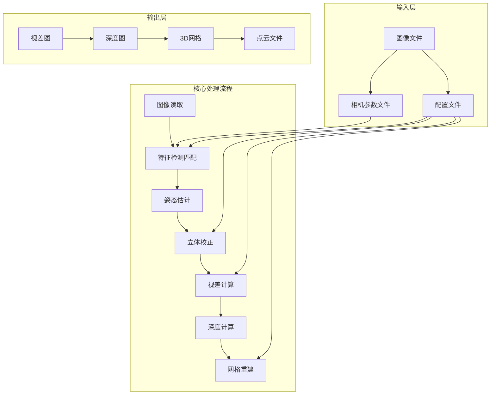
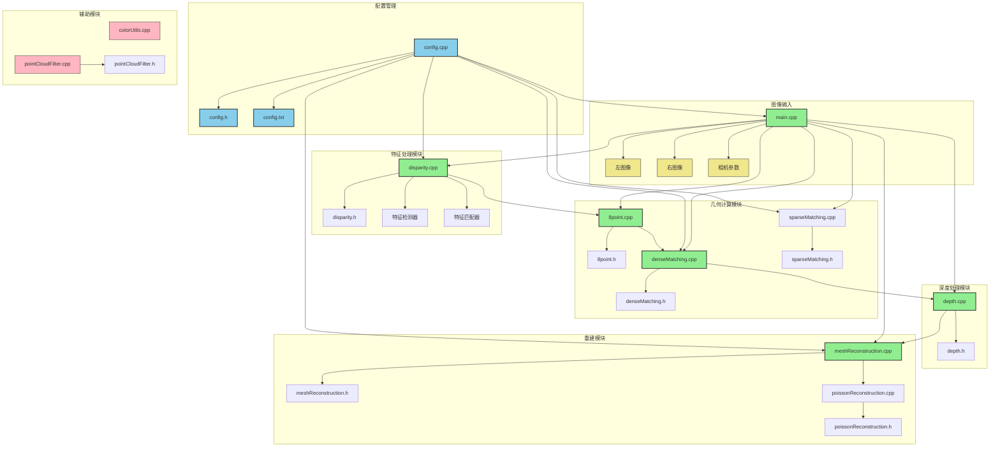
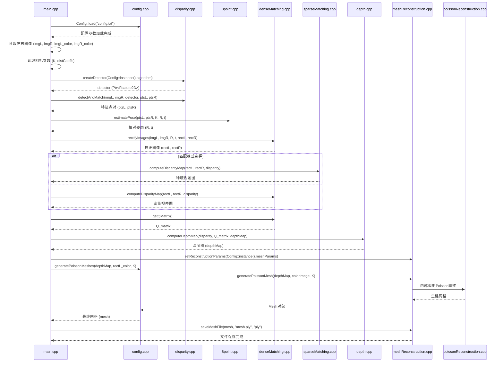

# 立体视觉系统流程图 - 程序依赖关系与变量传递

## 系统架构概览



## 详细程序依赖关系图



## 变量传递关系图

```mermaid
graph LR
    subgraph "输入变量"
        INPUT_IMG_L[imgL: cv::Mat] 
        INPUT_IMG_R[imgR: cv::Mat]
        INPUT_IMG_L_COLOR[imgL_color: cv::Mat]
        INPUT_IMG_R_COLOR[imgR_color: cv::Mat]
        CAMERA_K[K: cv::Mat]
        CAMERA_DIST[distCoeffs: cv::Mat]
        CONFIG_PARAMS[Config::instance()]
    end
    
    subgraph "特征处理阶段"
        FEATURE_PTS_L[ptsL: vector<Point2f>]
        FEATURE_PTS_R[ptsR: vector<Point2f>]
        FEATURE_DETECTOR[detector: Ptr<Feature2D>]
    end
    
    subgraph "几何计算阶段"
        POSE_R[R: cv::Mat]
        POSE_T[t: cv::Mat]
        RECT_L[rectL: cv::Mat]
        RECT_R[rectR: cv::Mat]
        RECT_L_COLOR[rectL_color: cv::Mat]
        RECT_R_COLOR[rectR_color: cv::Mat]
    end
    
    subgraph "视差深度阶段"
        DISPARITY_MAP[disparity: cv::Mat]
        Q_MATRIX[Q_matrix: cv::Mat]
        DEPTH_MAP[depthMap: cv::Mat]
    end
    
    subgraph "重建阶段"
        MESH_RESULT[mesh: MeshReconstruction::Mesh]
    end
    
    %% 变量传递关系
    INPUT_IMG_L --> FEATURE_DETECTOR
    INPUT_IMG_R --> FEATURE_DETECTOR
    FEATURE_DETECTOR --> FEATURE_PTS_L
    FEATURE_DETECTOR --> FEATURE_PTS_R
    
    FEATURE_PTS_L --> POSE_R
    FEATURE_PTS_R --> POSE_R
    CAMERA_K --> POSE_R
    POSE_R --> POSE_T
    
    INPUT_IMG_L --> RECT_L
    INPUT_IMG_R --> RECT_R
    POSE_R --> RECT_L
    POSE_T --> RECT_L
    POSE_R --> RECT_R
    POSE_T --> RECT_R
    CAMERA_K --> RECT_L
    CAMERA_K --> RECT_R
    
    INPUT_IMG_L_COLOR --> RECT_L_COLOR
    INPUT_IMG_R_COLOR --> RECT_R_COLOR
    POSE_R --> RECT_L_COLOR
    POSE_T --> RECT_L_COLOR
    POSE_R --> RECT_R_COLOR
    POSE_T --> RECT_R_COLOR
    
    RECT_L --> DISPARITY_MAP
    RECT_R --> DISPARITY_MAP
    CONFIG_PARAMS --> DISPARITY_MAP
    
    DISPARITY_MAP --> DEPTH_MAP
    Q_MATRIX --> DEPTH_MAP
    
    DEPTH_MAP --> MESH_RESULT
    RECT_L_COLOR --> MESH_RESULT
    CAMERA_K --> MESH_RESULT
    CONFIG_PARAMS --> MESH_RESULT
```

## 详细处理流程时序图



## 模块功能与依赖关系表

| 模块 | 主要功能 | 输入变量 | 输出变量 | 依赖模块 | 状态 |
|------|----------|----------|----------|----------|------|
| **config.cpp** | 配置管理 | config.txt | Config::instance() | 无 | ✅ 活跃 |
| **disparity.cpp** | 特征检测匹配 | imgL, imgR, algorithm | ptsL, ptsR, detector | config | ✅ 活跃 |
| **8point.cpp** | 姿态估计 | ptsL, ptsR, K | R, t | disparity | ✅ 活跃 |
| **denseMatching.cpp** | 立体校正+密集匹配 | imgL, imgR, R, t, K | rectL, rectR, disparity, Q | 8point, config | ✅ 活跃 |
| **sparseMatching.cpp** | 稀疏匹配 | rectL, rectR | disparity | denseMatching | ✅ 活跃 |
| **depth.cpp** | 深度计算 | disparity, Q_matrix | depthMap | denseMatching | ✅ 活跃 |
| **meshReconstruction.cpp** | 网格重建 | depthMap, colorImage, K | mesh | depth, config | ✅ 活跃 |
| **poissonReconstruction.cpp** | Poisson重建 | depthMap, colorImage, K | mesh | meshReconstruction | ⚠️ 间接 |
| **pointCloudFilter.cpp** | 点云滤波 | pointCloud | filteredPointCloud | meshReconstruction | ❌ 未使用 |
| **colorUtils.cpp** | 颜色处理 | disparity, colorImage | colorDisparity | 无 | ❌ 未使用 |

## 数据流总结

### 主要数据流路径
1. **图像输入** → **特征检测** → **姿态估计** → **立体校正** → **视差计算** → **深度计算** → **网格重建**

### 关键变量传递链
- `imgL, imgR` → `ptsL, ptsR` → `R, t` → `rectL, rectR` → `disparity` → `depthMap` → `mesh`

### 配置参数影响
- `Config::instance()` 影响所有主要模块的参数设置
- 通过配置文件统一管理算法参数

### 未充分利用的模块
- `pointCloudFilter.cpp`: 可在深度计算后添加滤波步骤
- `colorUtils.cpp`: 可替代main.cpp中的重复实现 